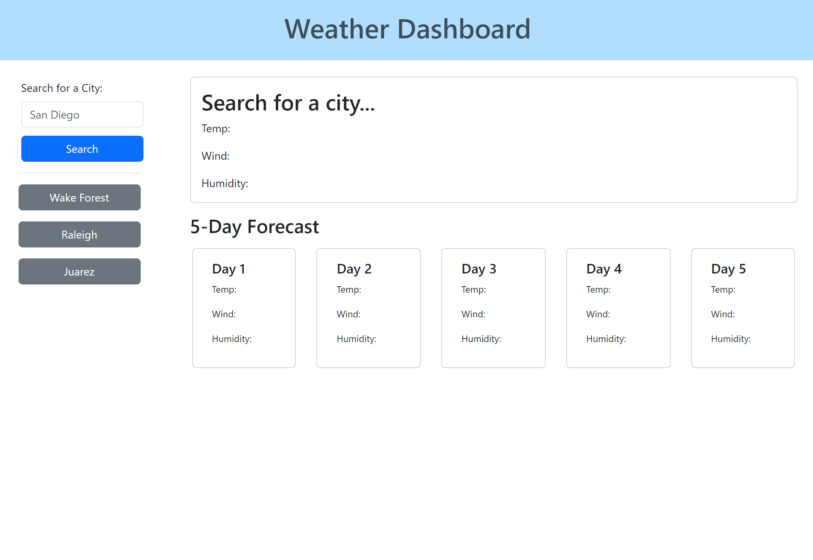

# Weather Dashboard / Module 06

## Description

This is a simple web app that allows you to search for a city's weather, where you are given the date, temperature, wind speed, humidity, and a pictoral representation of the current weather conditions -- both for the current day and as part of a 5-day weather forecast. When you successfully search for a city once, that city is saved to your history, and you can easily access the weather for that city again by clicking on the button of the same name below the search bar. These results will persist even if you leave the webpage and return to it.

## Usage

Visit https://obelisk477.github.io/weather-dashboard/ to use the app. In the "Search for a City" input form, type the name of a city that you'd like to see the weather for, and then click the search button. The results will display on the page to the right. If at any point you'd like to see results for that same city in the future, the history below the search bar contains buttons for that city that will reload the weather for that location.

## Screenshot

## License

Please refer to the LICENSE in the repo.

## Credits

* MIT License generated by GitHub